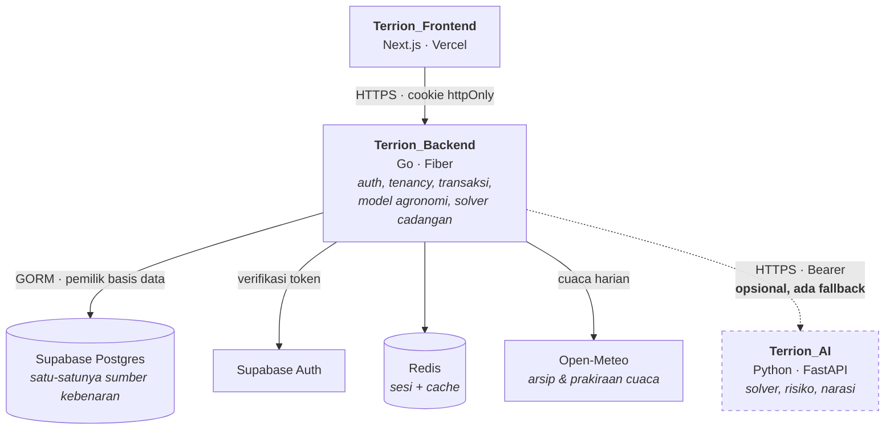

# Terrion_Backend

API dan mesin agronomi **Terrion** — sistem pelacakan lahan dan perencanaan
tanam untuk koperasi tani Indonesia. Ditulis dengan Go 1.25 dan Fiber v2.

Repo ini adalah **pemilik tunggal basis data**. Seluruh autentikasi, tenancy,
transaksi, dan pemodelan agronomi hidup di sini.

| Repo | Isi |
| --- | --- |
| `Terrion_Backend` | repo ini — API, basis data, model agronomi |
| [`Terrion_Frontend`](https://github.com/ITechnoCup2026/Terrion_Frontend) | antarmuka Next.js |
| `Terrion_AI` | layanan perencanaan Python, **opsional** |

---

## 1. Penjelasan aplikasi

Sebuah koperasi dengan puluhan lahan hampir selalu menanam pada waktu yang
berdekatan — hujan datang bersamaan, dan tetangga menanam bersamaan. Tiga bulan
kemudian seluruh lahan panen di minggu yang sama: gudang tidak muat, truk tidak
cukup, dan harga jatuh persis ketika semua orang punya paling banyak untuk
dijual. Tidak ada satu petani pun yang berbuat salah; yang salah adalah
**waktunya**, dan tidak ada yang melihat waktu itu untuk seluruh koperasi
sekaligus.

Terrion melihatnya sekaligus. Ia melacak tiap lahan dan tiap blok tanam,
menyimulasikan kematangan tanaman terhadap sepuluh tahun riwayat cuaca nyata,
memperkirakan kapan dan berapa banyak panen akan datang, lalu menandai minggu
yang menumpuk sebelum minggu itu tiba.

**Yang membedakannya:** model panennya belajar dari koperasi itu sendiri. Setiap
panen yang dicatat kader memperbaiki prediksi berikutnya, dan besar
perbaikannya sebanding dengan berapa banyak panen yang sudah tercatat —
koperasi dengan dua catatan tidak boleh menggeser prediksi sejauh koperasi
dengan dua puluh.



Garis putus-putus adalah bagian yang boleh mati tanpa fitur ikut mati.
Rancangan lengkapnya ada di [`docs/ARCHITECTURE.md`](docs/ARCHITECTURE.md).

---

## 2. Fitur utama

| Fitur | Penjelasan |
| --- | --- |
| **Prediksi panen yang belajar** | Akumulasi Growing Degree Days terhadap normals sepuluh tahun. Tiap panen yang dicatat menggeser prediksi berikutnya, dengan penyusutan `n/(n+3)` supaya sampel kecil tidak berlebihan |
| **Jendela panen, bukan tanggal** | Prediksi selalu berupa rentang. Rentang menyempit sendiri saat cuaca teramati menggantikan klimatologi |
| **Deteksi tabrakan panen** | Menandai minggu yang melewati kapasitas tampung koperasi, dan menyebut blok mana yang menyumbang |
| **Saran penggeseran tanam** | Mengusulkan pergeseran tanggal tanam yang menurunkan puncak, dan menolak dengan alasan jelas kalau bloknya sudah ditanam |
| **Atlas publik** | Halaman lahan publik membaca view `public_plot` yang **memang tidak punya kolom koordinat** — privasi ditegakkan oleh skema, bukan oleh lapis tampilan |
| **RDKK & permintaan pasokan** | Rencana kebutuhan sarana produksi dan penghubungan koperasi dengan pembeli |

---

## 3. Teknologi yang digunakan

| Pustaka | Peruntukan | Kenapa ini |
| --- | --- | --- |
| `gofiber/fiber/v2` | Kerangka HTTP | Ringan, mendekati `net/http`, tanpa magic yang menyembunyikan alur permintaan |
| `gorm.io/gorm` + `driver/postgres` | ORM dan driver | Migrasi entitas diuji terhadap skema nyata lewat `TestEntitiesMatchMigrations` |
| `golang-migrate/migrate/v4` | Migrasi skema | `cmd/migrate` adalah satu-satunya jalur perubahan skema |
| `golang-jwt/jwt/v5` | Verifikasi token Supabase | Token diverifikasi di sisi server; ia tidak pernah menyentuh JavaScript peramban |
| `redis/go-redis/v9` | Sesi dan cache | Token disimpan di Redis di balik cookie `httpOnly` |
| `go-playground/validator/v10` | Validasi permintaan | Validasi deklaratif di batas HTTP |
| `sirupsen/logrus` | Log terstruktur | — |
| `google/uuid` | Pengenal | — |
| `glebarez/sqlite`, `alicebob/miniredis` | Uji | Seluruh uji berjalan tanpa Postgres dan tanpa Redis yang berjalan |

Model agronomi ditulis dengan **pustaka standar Go saja** — regresi ridge dengan
penyelesai Gauss sendiri, estimator penyusutan, dan simulator GDD. Tidak ada
dependensi numerik pihak ketiga.

---

## 4. Cara instalasi

Prasyarat: Go 1.25+, PostgreSQL 15+ (atau proyek Supabase), Redis.

```bash
git clone https://github.com/ITechnoCup2026/Terrion_Backend.git
cd Terrion_Backend
go mod download

cp .env.example .env    # isi sesuai tabel di bawah
go run ./cmd/migrate up
```

| Variabel | Guna |
| --- | --- |
| `DB_HOST`, `DB_PORT`, `DB_USER`, `DB_PASSWORD`, `DB_NAME`, `DB_SSLMODE` | Koneksi Postgres |
| `DB_POOL_MAX`, `DB_POOL_IDLE`, `DB_POOL_LIFETIME` | Kolam koneksi |
| `SUPABASE_URL`, `SUPABASE_ANON_KEY`, `SUPABASE_SERVICE_ROLE_KEY`, `SUPABASE_JWT_SECRET` | Autentikasi |
| `REDIS_URL` | Sesi dan cache |
| `WEB_PORT`, `WEB_CORS_ORIGINS`, `WEB_PREFORK` | Server HTTP |
| `CRON_SECRET` | Melindungi endpoint terjadwal |
| `APP_ENV`, `APP_NAME`, `LOG_LEVEL` | Operasional |
| `AI_SERVICE_URL`, `AI_SERVICE_TOKEN` | **Opsional.** Kosongkan untuk memakai solver Go |

---

## 5. Cara penggunaan

```bash
go run ./cmd/web            # jalankan API di WEB_PORT
go test ./...               # seluruh uji, tanpa perlu Postgres atau Redis
go vet ./...
```

Perintah lain:

```bash
go run ./cmd/migrate up     # terapkan migrasi
go run ./cmd/migrate down   # mundur satu langkah
go run ./cmd/register       # daftarkan pengguna awal
```

Sebagian endpoint:

| Metode | Jalur | Akses |
| --- | --- | --- |
| `GET` | `/api/health` | publik |
| `POST` | `/api/auth/signup`, `/api/auth/login`, `/api/auth/refresh`, `/api/auth/logout` | publik |
| `GET` | `/api/catalog`, `/api/atlas/cooperatives`, `/api/public/plots/:publicId` | publik |
| `GET` | `/api/dashboard`, `/api/plots`, `/api/plots/:id` | anggota |
| `POST` | `/api/plots`, `/api/blocks/:id/split` | petugas lapangan |
| `PATCH` | `/api/blocks/:id/harvest` | petugas lapangan — menutup gelung kalibrasi |
| `POST` | `/api/stagger` | petugas lapangan |
| `GET`/`POST` | `/api/rdkk`, `/api/input-orders`, `/api/supply-requests` | anggota |

---

## 6. Keamanan dan penggunaan AI secara bertanggung jawab

**Token tidak pernah menyentuh peramban.** Token Supabase disimpan di Redis di
balik cookie `httpOnly` `SameSite=Lax`; JavaScript di sisi klien tidak bisa
membacanya.

**Tenancy ditegakkan di lapis usecase pada setiap kueri**, bukan hanya di
kebijakan basis data, sehingga sebuah koperasi tidak pernah melihat lahan
koperasi lain.

**Halaman publik tidak menyembunyikan koordinat, ia tidak memilikinya.** View
`public_plot` memang tidak punya kolom koordinat. Kebocoran di sini menuntut
perubahan migrasi, bukan sekadar kelalaian di lapis tampilan.

**Layanan AI tidak pernah menerima data pribadi.** Ketika `AI_SERVICE_URL`
diisi, yang menyeberang hanyalah soal matematika yang sudah jadi: luas, tonase,
tanggal, dan referensi buram (`p1`, `k1`, `v3`) yang dibangkitkan ulang setiap
permintaan. Tidak ada nama, NIK, koordinat, atau nama desa — bukan karena
disaring, tetapi karena tipe payload tidak punya field-nya.

**Angka dari layanan AI tidak pernah dipercaya.** Yang diterima hanyalah
*pilihan* — kandidat mana yang masuk rencana mana. Seluruh tonase, jendela
panen, dan nilai rupiah dihitung ulang dari tabel kandidat yang repo ini sendiri
bangun. Kandidat yang tidak pernah diterbitkan akan ditolak, bukan disimpan.

**Kalau layanan AI mati, fitur tetap jalan** dengan solver di dalam Go, dan
responsnya jujur menyebut mesin mana yang dipakai lewat field `engine`.

Uraian lengkap, termasuk analisis radius ledakan, ada di
[`docs/ARCHITECTURE.md`](docs/ARCHITECTURE.md) §5 dan §7.

---

## 7. Provenans data

Sebagian data acuan pada seed bersifat sintetis, dan itu dinyatakan alih-alih
disembunyikan:

| Sumber | Status |
| --- | --- |
| `weather_daily`, `weather_normals` | **Nyata** — Open-Meteo, sepuluh tahun harian |
| `variety.base_temp_c` | **Nyata, tersitasi** — FAO56rev |
| `variety.gdd_requirement` | **Diturunkan** |
| `block` (panen tercatat) | **Nyata** bila kader mencatat |
| `reference_price` | **SINTETIS** — satu gelombang sinus per tahun |
| `region_stat` | Bobot provinsi dikarang; kode BPS asli |

Karena `reference_price` sintetis, **selisih nilai rupiah tidak boleh dibaca
sebagai rupiah nyata.** Panel harga membawa field `source` sampai ke layar
justru supaya hal ini terlihat pengguna, bukan hanya tertulis di sini.

---

## Struktur

```
cmd/           web, migrate, register
internal/
  agronomy/    GDD, fenologi, model hasil, kalibrasi, deteksi tabrakan
  usecase/     aturan bisnis, penegakan tenancy
  repository/  akses basis data
  delivery/    HTTP: rute, controller, middleware
  entity/      model GORM
  model/       bentuk permintaan dan respons
db/migrations/ satu-satunya jalur perubahan skema
docs/          arsitektur dan ADR
```
