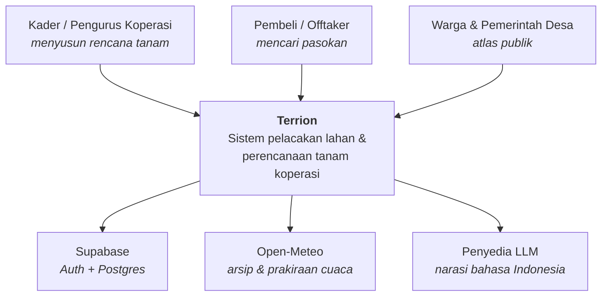
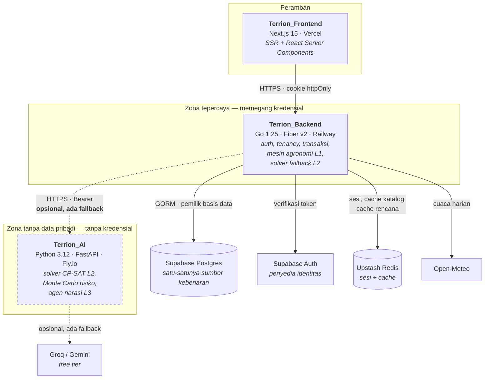
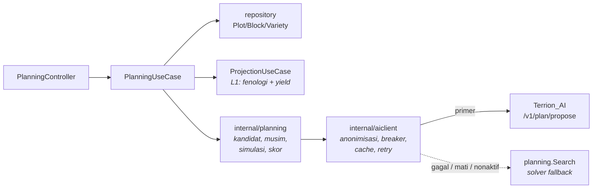
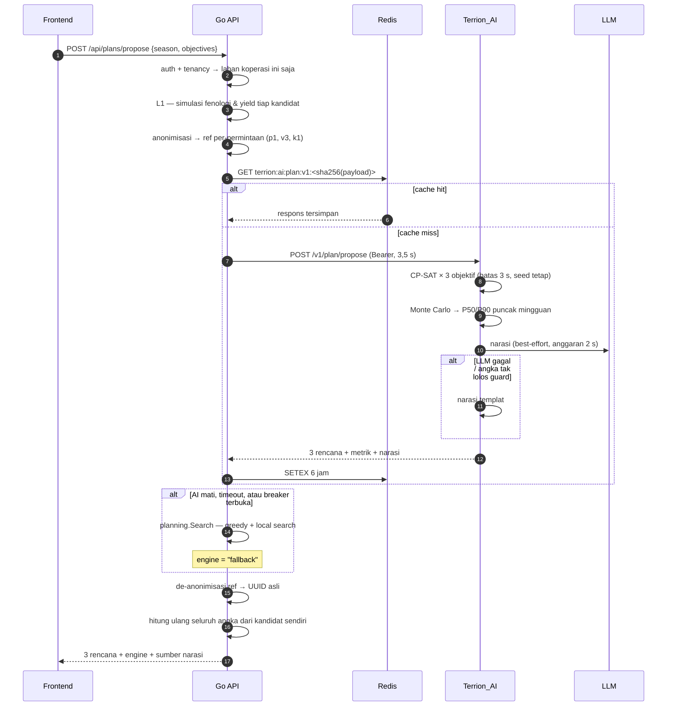
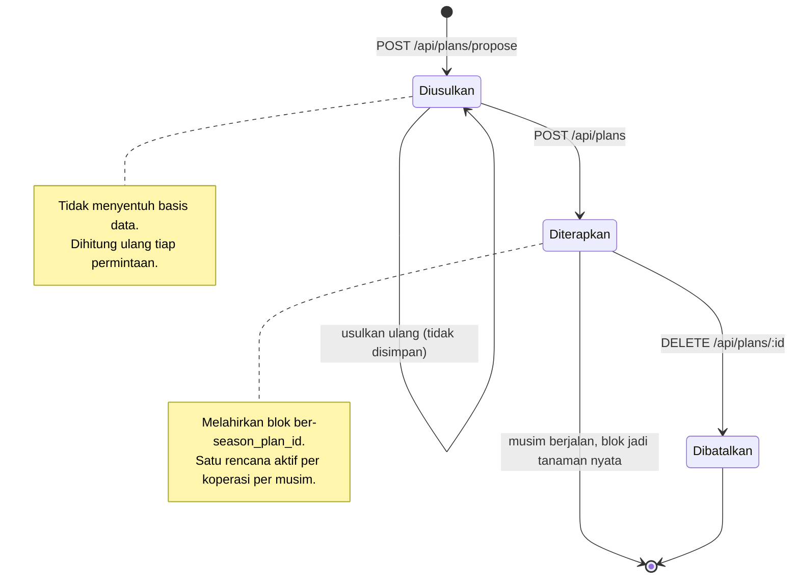
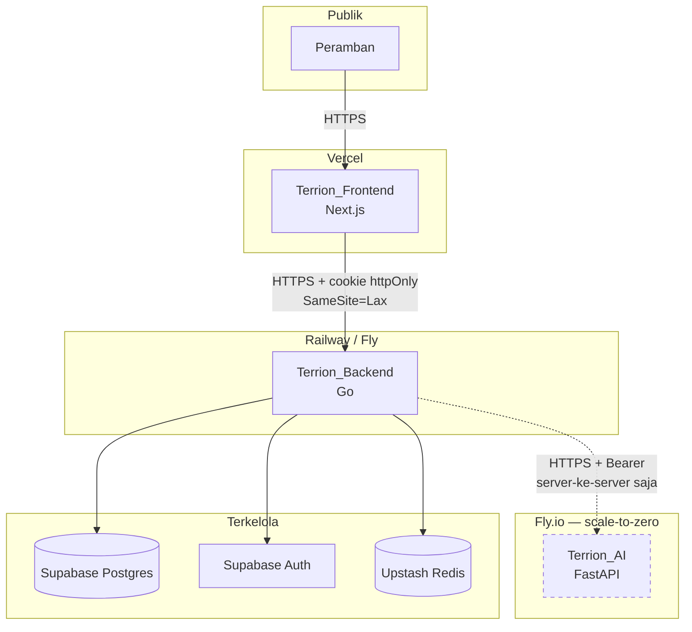

# Arsitektur Sistem Terrion — Pemisahan Layanan AI

> Dokumen ini adalah **kontrak bersama** antara `Terrion_Backend` (Go) dan
> `Terrion_AI` (Python). Dua orang mengerjakan dua repo. Dokumen inilah yang
> membuat keduanya bisa jalan tanpa saling menunggu.
>
> Turunannya: `RENCANA_BACKEND_INTEGRASI_AI.md` (sisi Go) dan
> `RENCANA_AI_SERVICE_PYTHON.md` (sisi Python).
>
> Versi kontrak yang dibekukan dokumen ini: **`v1.0`**.

---

## Daftar Isi

- [0. Batas waktu, dan apa yang ia paksa](#0-batas-waktu-dan-apa-yang-ia-paksa)
- [1. Keputusan pemisahan repo — sekarang jawabannya berubah](#1-keputusan-pemisahan-repo--sekarang-jawabannya-berubah)
- [2. Di mana garis potongnya](#2-di-mana-garis-potongnya)
- [3. Diagram C4](#3-diagram-c4)
- [4. Kontrak `v1.0`](#4-kontrak-v10)
- [5. Anonimisasi sebagai konsekuensi bentuk kontrak](#5-anonimisasi-sebagai-konsekuensi-bentuk-kontrak)
- [6. Keandalan: anggaran waktu, retry, breaker, cache, degradasi](#6-keandalan-anggaran-waktu-retry-breaker-cache-degradasi)
- [7. Topologi penyebaran dan permukaan keamanan](#7-topologi-penyebaran-dan-permukaan-keamanan)
- [8. Bagaimana dua repo dijaga tetap seiring](#8-bagaimana-dua-repo-dijaga-tetap-seiring)
- [9. ADR — sepuluh keputusan arsitektur](#9-adr--sepuluh-keputusan-arsitektur)
- [10. Triase terhadap tenggat](#10-triase-terhadap-tenggat)
- [11. Apa yang dibaca ke juri](#11-apa-yang-dibaca-ke-juri)

---

## 0. Batas waktu, dan apa yang ia paksa

Dari guidebook, halaman *Pengerjaan* dan *Timeline*:

| Peristiwa | Tanggal |
| --- | --- |
| **Batas pengumpulan penyisihan** | **Minggu, 6 September 2026, 23.59 WIB** |
| Pengumuman finalis | 12 September 2026 |
| Babak final (pitching + live demo) | 19–20 September 2026 |

Hari ini 5 September 2026. Tersisa **satu hari** untuk penyisihan, lalu jeda
dua minggu sebelum final.

Menambah layanan kedua satu hari sebelum tenggat adalah keputusan yang, kalau
dilakukan dengan urutan yang salah, menghancurkan pengumpulan. Kalau dilakukan
dengan urutan yang benar, ia justru menaikkan dua pos penilaian sekaligus
(Implementasi Teknologi 15%, Dokumentasi & Repositori 10%) tanpa risiko.

Urutan yang benar hanya ada satu, dan seluruh dokumen ini disusun untuk
menegakkannya:

> **Backend Go harus lengkap, benar, dan ter-deploy tanpa layanan Python ada.**
> Layanan Python adalah *peningkatan*, bukan *dependensi*.

Secara mekanis ini ditegakkan oleh satu baris konfigurasi: kalau
`AI_SERVICE_URL` kosong, `aiclient` tidak dikonstruksi, dan `PlanningUseCase`
memakai solver Go bawaannya. Tidak ada cabang kode yang gagal, tidak ada
endpoint yang hilang, tidak ada layar frontend yang kosong. Bedanya hanya satu
field di respons: `"engine": "fallback"` alih-alih `"engine": "ai-service"`.

Konsekuensi pembagian kerja:

| Orang | Repo | Boleh mulai kapan | Diblokir oleh |
| --- | --- | --- | --- |
| Anda | `Terrion_Backend` | sekarang | tidak ada |
| Teman Anda | `Terrion_AI` | sekarang | tidak ada — cukup satu file fixture JSON |

Tidak ada arah blokir di antara keduanya. Itu bukan kebetulan; itu tujuan
desain nomor satu dari pemisahan ini.

---

## 1. Keputusan pemisahan repo — sekarang jawabannya berubah

Di `RENCANA_AI_FITUR_RENCANA_TANAM.md` §1 saya menolak repo terpisah. Penolakan
itu masih benar **untuk premis yang saya punya saat itu**: satu orang, satu
mesin agronomi Go yang sudah teruji, dan tidak ada pekerjaan yang benar-benar
butuh ekosistem Python.

Dua informasi baru mengubah premisnya, dan keduanya adalah persis kondisi yang
sudah saya tulis di §1.2 sebagai "kapan jawabannya akan berbeda":

1. **Dua orang, dua bidang.** Anda menulis Go, teman Anda menulis AI. Repo
   tunggal berarti dua orang menabrak `internal/planning` yang sama, memakai
   toolchain yang sama, dan saling menunggu review. Batas repo di sini bukan
   batas teknis, ia batas kepemilikan — dan itu alasan yang sah.
2. **Pekerjaan AI-nya sekarang memang butuh Python.** Begitu perencananya
   diangkat dari "greedy + local search" ke **CP-SAT (OR-Tools)** dan
   ketidakpastiannya diangkat dari "kasus terburuk yang dikolapskan" ke
   **Monte Carlo bervektor (NumPy)**, memaksanya ke Go berarti menulis ulang
   dua pustaka riset dari nol. Itu bukan disiplin, itu keras kepala.

Ada alasan ketiga yang tidak saya punya waktu itu: **penilaian**. Rubrik
penyisihan memberi 15% pada *Implementasi Teknologi* ("struktur kode, efisiensi
teknologi, keamanan dasar, penerapan teknologi modern secara tepat") dan 10%
pada *Dokumentasi & Repositori*. Arsitektur dua layanan dengan kontrak
berversi, degradasi terencana, dan batas data pribadi yang ditegakkan oleh
bentuk kontrak adalah jawaban yang sangat kuat untuk keduanya — **asalkan
terdokumentasi**. Dokumen inilah dokumentasinya.

**Yang tidak berubah dari penolakan lama:** basis data tetap satu, dan hanya Go
yang menyentuhnya. Alasan §1.1 yang paling kuat — "dua layanan yang sama-sama
menulis ke Postgres berarti dua pemilik skema, dan itu kelas bug yang tidak
akan selesai dalam sisa waktu" — tetap berlaku utuh. Pemisahan ini memindahkan
*komputasi*, bukan *kepemilikan data*.

---

## 2. Di mana garis potongnya

Fitur ini punya tiga lapis. Pertanyaan sesungguhnya bukan "repo baru atau
tidak", tapi "**lapis mana yang pindah**".

| Lapis | Isi | Tinggal di | Alasan |
| --- | --- | --- | --- |
| **L1 — Agronomi** | GDD/fenologi, ridge yield model, kalibrasi per-varietas | **Go** | Sudah ada, sudah teruji, terikat entitas & cuaca di basis data. Menyalinnya ke Python = dua sumber kebenaran untuk angka yang sama. |
| **L2 — Perencana** | Optimasi kombinatorial 3 objektif, propagasi ketidakpastian | **Python** *(primer)* + **Go** *(fallback)* | Ini masalah OR murni. Payload-nya adalah angka lepas. Python punya CP-SAT dan NumPy; Go tidak. |
| **L3 — Agen** | Narasi bahasa Indonesia, penerjemahan niat | **Python** | Klien LLM, retry, guardrail, prompt sebagai aset — semuanya lebih murah di Python, dan tidak boleh berbagi proses dengan API yang memegang kredensial basis data. |

Yang menyeberangi kabel karena itu adalah **soal matematika yang sudah jadi**,
bukan data mentah:

```
Go  ──▶  "ini 340 kandidat (lahan × varietas × tanggal), masing-masing dengan
          jendela panen, rentang tonase, dan harga acuan.
          Kapasitas 12,5 t/minggu. Permintaan pembeli per minggu segini.
          Beri saya tiga rencana."
Py  ──▶  "rencana Aman = kandidat [c003, c017, ...], P90 puncak 11,8 t.
          rencana Pendapatan = [...]. rencana Pasar = [...].
          Ini narasinya."
```

Tiga sifat yang membuat potongan ini benar, dan yang tidak dimiliki potongan
mana pun yang lain:

1. **Payload-nya tanpa data pribadi secara struktural.** Tidak ada nama, NIK,
   koordinat, nama desa — bukan karena disaring, tapi karena tipe di kedua sisi
   tidak punya field-nya (§5).
2. **Python tidak butuh basis data.** Tanpa kredensial Postgres, tanpa kunci
   Supabase, tanpa migrasi, tanpa koordinasi skema. Radius ledakan kalau ia
   jebol adalah "saran tanam yang salah", bukan kebocoran data anggota.
3. **Fallback-nya gratis.** Solver Go yang sudah direncanakan di
   `docs/superpowers/plans/2026-09-04-rencana-tanam-musim-depan.md` (greedy +
   local search terbatas) tidak dibuang — ia menjadi jaminan ketersediaan. Ini
   yang membuat repo Python tidak pernah menjadi jalur kritis.

### Potongan yang ditolak, dan alasannya

| Potongan alternatif | Kenapa ditolak |
| --- | --- |
| Python memiliki L1 juga (fenologi + yield) | Perlu akses basis data atau payload cuaca raksasa; menduplikasi logika yang sudah lulus uji di Go; membuat `TestEntitiesMatchMigrations` dan kalibrasi kehilangan satu-satunya sumber kebenarannya. Satu hari sebelum tenggat, ini bunuh diri. |
| Python memiliki basis data sendiri | Dua pemilik skema. Ditolak di `RENCANA_AI...` §1.1 dan alasannya tidak berubah. |
| Antrean pesan (Kafka/Rabbit) alih-alih HTTP | `Propose` adalah operasi sinkron yang menunggu jawaban pengguna dalam hitungan detik. Antrean menambah komponen yang harus di-host, dipantau, dan dijelaskan, untuk masalah yang tidak ada. |
| gRPC alih-alih HTTP+JSON | Menambah generator kode, `.proto`, dan build step di dua repo. Payload kita ~200 KB sekali per permintaan, di belakang cache. Keuntungannya nol; biayanya satu hari. |

---

## 3. Diagram C4

### L1 — Konteks



### L2 — Kontainer



Garis putus-putus adalah bagian yang boleh mati tanpa fitur ikut mati. Itu
seluruh cerita ketersediaan sistem ini dalam satu gambar.

### L3 — Komponen jalur `POST /api/plans/propose`



### Urutan `Propose` dengan degradasinya



Langkah 20 adalah aturan keamanan yang tidak boleh dilanggar: **Go tidak
pernah mempercayai satu pun angka dari layanan AI.** Yang diterima dari Python
hanyalah *pilihan* — kandidat mana yang masuk rencana mana. Seluruh tonase,
jendela panen, dan nilai rupiah dibaca ulang dari tabel kandidat yang Go sendiri
bangun. Kalau Python mengirim `c999` yang tidak ada, rencananya ditolak dengan
`plan_assignment_rejected`, bukan disimpan.

### Daur hidup rencana



---

## 4. Kontrak `v1.0`

Satu endpoint kerja, dua endpoint operasional.

| Metode | Jalur | Guna |
| --- | --- | --- |
| `POST` | `/v1/plan/propose` | menyelesaikan soal, mengembalikan 3 rencana + narasi |
| `GET` | `/health` | liveness — proses hidup |
| `GET` | `/ready` | readiness — solver siap, konfigurasi lengkap |

Autentikasi: `Authorization: Bearer <AI_SERVICE_TOKEN>` pada `/v1/*`.
Tanpa header yang cocok → `401`, tanpa badan pesan yang menjelaskan apa pun.

### 4.1 Permintaan

```json
{
  "contract_version": "1.0",
  "request_id": "5a1f0c9e-3c2a-4b3e-9f5a-77c0e2b1d004",
  "seed": 20260905,
  "season": {
    "label": "MT I 2026/2027",
    "start": "2026-10-01",
    "end": "2027-03-31"
  },
  "objectives": ["aman", "pendapatan", "pasar"],
  "capacity_tonnes_per_week": 12.5,
  "candidates": [
    {
      "id": "c001",
      "plot_ref": "p1",
      "area_ha": 0.82,
      "commodity_ref": "k1",
      "variety_ref": "v3",
      "planting_date": "2026-10-05",
      "harvest_start": "2027-01-02",
      "harvest_end": "2027-01-16",
      "tonnes_low": 2.91,
      "tonnes_mid": 3.60,
      "tonnes_high": 4.42,
      "plausibility": "plausible",
      "price_per_kg": 5200.0
    }
  ],
  "demand": [
    { "commodity_ref": "k1", "iso_week": "2027-01-04", "kg": 4000 }
  ]
}
```

Aturan yang mengikat kedua sisi:

- `id` unik dalam satu permintaan; `^c[0-9]{3,5}$`.
- `plot_ref` `^p[0-9]+$`, `commodity_ref` `^k[0-9]+$`, `variety_ref` `^v[0-9]+$`.
  **Bukan UUID.** Dibangkitkan ulang tiap permintaan (§5).
- Semua tanggal `YYYY-MM-DD`, kalender Gregorian, tanpa zona waktu.
- `iso_week` adalah **tanggal Senin** dari minggu itu, bukan nomor minggu.
  Alasannya: aritmetika minggu ISO di tepi tahun berbeda antara Go dan Python;
  tanggal Senin tidak punya ambiguitas itu.
- `tonnes_low ≤ tonnes_mid ≤ tonnes_high`, semuanya `≥ 0`.
- `price_per_kg` boleh `null` — artinya tidak ada harga acuan untuk komoditas
  itu. Kalau **ada satu saja** kandidat terpilih tanpa harga, `gross_value`
  rencana itu wajib `null`, bukan sebagian.
- `plausibility` ∈ `{"plausible", "early", "late"}`.
- `seed` wajib. Python wajib deterministik terhadapnya (§ADR-0007).
- Batas ukuran: ≤ 2000 kandidat, ≤ 400 baris `demand`. Lebih dari itu → `422`.

### 4.2 Respons

```json
{
  "contract_version": "1.0",
  "request_id": "5a1f0c9e-3c2a-4b3e-9f5a-77c0e2b1d004",
  "solver": "cp-sat",
  "solver_version": "1.0.0",
  "elapsed_ms": 412,
  "plans": [
    {
      "objective": "aman",
      "candidate_ids": ["c001", "c014", "c087"],
      "metrics": {
        "peak_tonnes_p50": 9.1,
        "peak_tonnes_p90": 11.8,
        "total_tonnes": 31.4,
        "gross_value": 163280000.0,
        "demand_covered_kg": 12000
      },
      "narrative": "Rencana ini menyebar panen ke lima minggu...",
      "narrative_source": "llm"
    }
  ],
  "diagnostics": {
    "evaluations": 18420,
    "monte_carlo_draws": 2000,
    "objective_status": "OPTIMAL",
    "degraded": []
  }
}
```

- `plans` selalu berisi satu entri per objektif yang diminta, dengan urutan
  yang sama. Kalau satu objektif tidak punya solusi layak, entrinya tetap ada
  dengan `candidate_ids: []` dan `diagnostics.degraded` memuat namanya.
- `narrative_source` ∈ `{"llm", "template", "none"}`. Frontend memakai ini untuk
  memilih label — "Penjelasan AI" atau "Ringkasan otomatis". Kita tidak
  menyamarkan yang mana.
- `solver` ∈ `{"cp-sat", "greedy"}` — Python pun punya fallback internalnya.
- `elapsed_ms` **dikecualikan dari kunci cache dan dari uji determinisme.**

### 4.3 Galat

Amplop galat, dan hanya ini bentuknya:

```json
{ "error": { "code": "contract_version_unsupported", "message": "..." } }
```

| Kode HTTP | `code` | Perlakuan di Go |
| --- | --- | --- |
| `400` | `malformed_request` | **bug kita.** Log level `error`, langsung fallback, jangan retry. |
| `401` | `unauthenticated` | Log `error`, fallback, jangan retry. |
| `409` | `contract_version_unsupported` | Log `error`, fallback, jangan retry. Ini yang menangkap deploy tidak seiring. |
| `422` | `problem_too_large` | Log `warn`, fallback. |
| `500` | `solver_failed` | Retry sekali, lalu fallback. |
| `503` | `not_ready` | Retry sekali, lalu fallback. |
| `504` / timeout / koneksi | — | Retry sekali, lalu fallback. |

Perhatikan polanya: **setiap baris berakhir di fallback.** Tidak ada galat dari
layanan AI yang boleh sampai ke pengguna sebagai galat. Yang sampai ke pengguna
hanyalah rencana yang sedikit kurang bagus, dengan `engine: "fallback"`.

### 4.4 Versi

`contract_version` adalah `MAJOR.MINOR`.

- Python menerima permintaan dengan `MAJOR` yang sama dan `MINOR` ≤ miliknya.
  Selain itu → `409`.
- Penambahan field opsional menaikkan `MINOR`. Kedua sisi mengabaikan field
  yang tidak dikenal — Go dengan `encoding/json` bawaan, Python dengan
  `model_config = ConfigDict(extra="ignore")`.
- Perubahan yang merusak menaikkan `MAJOR` **dan** memindahkan jalur ke `/v2/`.
  Selama masa peralihan keduanya hidup berdampingan.

Satu slot perluasan sudah disediakan sekarang supaya `v2` tidak perlu memecah
apa pun: field opsional `observations` pada permintaan, berisi baris riwayat
panen ter-anonimisasi (fitur + indeks hasil), untuk saat Python nanti ikut
memiliki pemodelan hasil. Belum dikirim di `v1.0`; Pydantic sudah punya
tipenya dengan `default=None`.

---

## 5. Anonimisasi sebagai konsekuensi bentuk kontrak

Guidebook §Ketentuan Peserta butir 7 mewajibkan penggunaan AI yang etis, dengan
"perlindungan data pengguna, menjaga privasi, memastikan tidak ada celah
keamanan yang rentan". Ini bukan pos penilaian terpisah — ia masuk ke
"keamanan dasar" di Implementasi Teknologi (15%) dan ke pertanyaan juri di
babak final.

Terrion memegang data yang benar-benar sensitif: nama anggota koperasi,
koordinat lahan, nama desa, dan lewat gabungan ketiganya, identitas rumah
tangga petani. Model bahasa pihak ketiga adalah tempat terakhir yang boleh
melihatnya.

Jawaban yang biasa diberikan — "kami menyaring data pribadi sebelum
mengirim" — adalah janji. Janji bocor saat seseorang menambah field.

Jawaban di sini adalah **bentuk tipe**:

```go
type Candidate struct {
	ID           string   `json:"id"`
	PlotRef      string   `json:"plot_ref"`
	AreaHa       float64  `json:"area_ha"`
	CommodityRef string   `json:"commodity_ref"`
	VarietyRef   string   `json:"variety_ref"`
	PlantingDate string   `json:"planting_date"`
	HarvestStart string   `json:"harvest_start"`
	HarvestEnd   string   `json:"harvest_end"`
	TonnesLow    float64  `json:"tonnes_low"`
	TonnesMid    float64  `json:"tonnes_mid"`
	TonnesHigh   float64  `json:"tonnes_high"`
	Plausibility string   `json:"plausibility"`
	PricePerKg   *float64 `json:"price_per_kg"`
}
```

Tidak ada `MemberName`, tidak ada `PlotName`, tidak ada `Lat`/`Lng`, tidak ada
`Village`, tidak ada `CooperativeID`. Bukan disaring — **tidak ada
field-nya**. Menambahkan data pribadi ke payload memerlukan seseorang mengubah
definisi tipe di dua repo sekaligus, dan itu terlihat di review.

Dua penguatan di atasnya:

**Ref bersifat per-permintaan, bukan stabil.** `p1` dalam permintaan hari ini
dan `p1` dalam permintaan besok boleh menunjuk lahan yang berbeda. Pemetaan
`p1 → uuid` hidup di memori proses Go selama satu permintaan dan tidak pernah
ditulis ke mana pun. Akibatnya layanan AI — bahkan kalau lognya disimpan —
tidak bisa merakit profil lintas waktu untuk satu lahan tertentu. Memakai UUID
asli akan gratis secara implementasi dan justru itulah kenapa ia salah.

**Uji yang gagal kalau ada yang bocor.** Di repo Go,
`internal/aiclient/anonymise_test.go` membangun payload dari fixture yang
sengaja berisi string beracun — `"Bu Sri Wahyuni"`, `"Jalancagak"`,
`"-6.25"`, `"3204..."` — lalu men-`json.Marshal` seluruh permintaan dan
menegaskan tidak satu pun string itu muncul di byte hasilnya. Uji ini gagal
pada hari seseorang menambah field yang salah, bukan pada hari data bocor ke
pihak ketiga.

Sisi Python melengkapi dari arah berlawanan: `tests/test_no_personal_data.py`
menegaskan bahwa `Candidate.model_fields` persis sama dengan daftar putih yang
tertulis di file uji. Field baru di sisi Python tanpa pembaruan daftar putih →
gagal.

---

## 6. Keandalan: anggaran waktu, retry, breaker, cache, degradasi

### 6.1 Anggaran waktu

`POST /api/plans/propose` dianggarkan **8 detik total** dari sudut pandang
peramban. Pemecahannya:

| Tahap | Anggaran | Kalau lewat |
| --- | --- | --- |
| Auth + muat lahan/blok/varietas/harga | 800 ms | 500, ini masalah basis data |
| L1 — simulasi fenologi & yield seluruh kandidat | 1,5 s | dicatat, tidak dipotong |
| Cache lookup Redis | 50 ms | anggap miss |
| Panggilan `Terrion_AI` (termasuk 1 retry) | **3,5 s** | batalkan → fallback |
| `planning.Search` fallback | 1,2 s | batalkan → `plan_search_timeout` |
| Serialisasi + konversi | 200 ms | — |

Anggaran AI ditegakkan dengan `context.WithTimeout` pada `ctx` panggilan, bukan
dengan `http.Client.Timeout` saja, supaya pembatalannya merambat ke Python dan
Python bisa berhenti bekerja (`request.is_disconnected()` di FastAPI).

Di dalam anggaran 3,5 s itu, Python memakai:
- CP-SAT: `max_time_in_seconds = 1.0` **per objektif**, tiga objektif → 3,0 s
  batas keras; praktiknya selesai jauh lebih cepat karena masalahnya kecil.
- Monte Carlo: ~80 ms untuk 2000 undian × 3 rencana dengan NumPy tervektorisasi.
- LLM: anggaran terpisah 2,0 s, **dijalankan setelah** solver dan boleh gagal.

Kalau total internal Python melewati 3,0 s, ia mengembalikan hasil terbaik yang
sudah ditemukan CP-SAT dengan `objective_status: "FEASIBLE"`. Solver anytime.
Itu properti yang membuat batas waktu keras aman.

### 6.2 Retry

Satu kali, hanya untuk galat yang mungkin sementara (koneksi, timeout, 500,
503, 504), jeda 250 ms + jitter ±100 ms. Tidak pernah untuk 4xx.

Retry pada `POST` aman di sini karena `/v1/plan/propose` **murni**: ia tidak
menulis apa pun, dan dengan `seed` yang sama ia mengembalikan hasil yang sama.
Ini konsekuensi langsung dari memindahkan hanya komputasi, bukan kepemilikan
data.

### 6.3 Circuit breaker

Tanpa breaker, layanan AI yang mati membuat setiap permintaan membayar 3,5
detik sebelum jatuh ke fallback. Dengan 20 pengguna itu berarti antrean yang
tidak perlu.

Aturannya sesederhana mungkin, dan sengaja tanpa pustaka:

- 3 kegagalan berturut-turut → **terbuka** selama 60 detik.
- Saat terbuka, `Propose` mengembalikan `ErrBreakerOpen` seketika tanpa
  menyentuh jaringan; pemanggil langsung fallback.
- Setelah 60 detik → **setengah terbuka**: satu permintaan diloloskan. Berhasil
  → tertutup dan penghitung nol. Gagal → terbuka lagi 60 detik.
- Sukses apa pun saat tertutup menolkan penghitung.

Implementasinya `sync.Mutex` + tiga field. Sekitar 50 baris, pustaka standar.

### 6.4 Cache

Kunci: `terrion:ai:plan:v1:<sha256(canonical JSON permintaan)>`, TTL 6 jam.

"Canonical" berarti: `json.Marshal` dari struct Go (urutan field tetap oleh
definisi struct), dengan `request_id` **dikosongkan** sebelum di-hash. Kalau
tidak, setiap permintaan unik dan cache tidak pernah kena.

Kenapa cache ini sangat efektif di sini: soal perencanaan hanya berubah kalau
lahan, blok, varietas, harga acuan, atau permintaan pembeli berubah. Dalam satu
sesi demo, itu tidak berubah sama sekali. Panggilan pertama membayar cold start
Fly.io; sisanya dilayani dari Upstash dalam ~30 ms.

**Untuk babak final:** panaskan cache sebelum live demo dengan memanggil
`Propose` sekali untuk musim yang akan didemokan. Ini bukan kecurangan, ini
prosedur operasi — dan kalau juri bertanya, jawabannya adalah desain cache di
atas, yang justru menguntungkan.

Invalidasi: kunci ini ikut dihapus oleh `CatalogUseCase.Invalidate` saat sebuah
rencana diterapkan atau dibatalkan, karena keduanya mengubah blok.

### 6.5 Pemanasan (opsional, mati secara bawaan)

`AI_WARMUP_INTERVAL` (detik, `0` = mati). Kalau diset dan `AI_SERVICE_URL`
terisi, `cmd/web` menjalankan satu goroutine ticker yang memanggil `GET /health`
dan membuang hasilnya.

Bawaan `0` disengaja: pada tingkat gratis, layanan yang tidak pernah tidur
justru menghabiskan kuota jam bulanan. Nyalakan di hari final saja, bukan
sepanjang bulan.

### 6.6 Ringkasan degradasi

| Yang mati | Yang pengguna lihat | Yang hilang |
| --- | --- | --- |
| LLM | narasi templat berbahasa Indonesia | keluwesan kalimat |
| Solver CP-SAT | solver greedy di dalam Python | ~beberapa % kualitas rencana |
| Seluruh `Terrion_AI` | `planning.Search` di Go, `engine: "fallback"` | P90 Monte Carlo, narasi LLM |
| Redis | semuanya jalan, lebih lambat | cache |
| `AI_SERVICE_URL` tidak diset | identik dengan baris ketiga | — |

Tidak ada baris yang berbunyi "fitur mati". Itu poin keseluruhannya.

---

## 7. Topologi penyebaran dan permukaan keamanan



| Komponen | Rahasia yang dipegang | Bisa dijangkau dari peramban |
| --- | --- | --- |
| Frontend | tidak ada | ya |
| Go API | `DB_*`, `SUPABASE_*`, `REDIS_URL`, `CRON_SECRET`, `AI_SERVICE_TOKEN` | ya |
| **Terrion_AI** | `AI_SERVICE_TOKEN`, `LLM_API_KEY` | **tidak** |

Analisis radius ledakan — jawaban untuk pertanyaan juri "kalau layanan AI-nya
dibobol, apa yang terjadi?":

1. Penyerang tidak mendapat kredensial basis data — layanan itu tidak punya.
2. Tidak mendapat data pribadi — payload tidak memuatnya, dan ref tidak stabil
   lintas permintaan, jadi log lama pun tidak merakit apa pun.
3. Tidak bisa menulis ke Terrion — komunikasinya satu arah, Go yang memanggil.
4. Yang bisa dilakukan: mengembalikan rencana yang buruk. Go menghitung ulang
   seluruh angka dan menolak `candidate_id` yang tidak ia terbitkan sendiri,
   jadi yang paling buruk terjadi adalah *pilihan* yang tidak optimal — yang
   tetap harus disetujui manusia lewat `POST /api/plans` sebelum jadi apa pun.

Ini adalah properti dari arsitekturnya, bukan dari kontrol yang ditambahkan
belakangan. Itu yang membuatnya layak dibacakan.

Kontrol lain yang sudah ada dan tetap berlaku: token Supabase tidak pernah
menyentuh JavaScript peramban (disimpan di Redis di balik cookie httpOnly),
tenancy ditegakkan di lapis usecase pada setiap kueri, CORS dibatasi daftar
origin, dan `cmd/migrate` adalah satu-satunya jalur perubahan skema.

---

## 8. Bagaimana dua repo dijaga tetap seiring

Ini pertanyaan yang membunuh sebagian besar arsitektur multi-layanan, dan
jawabannya di sini tidak butuh infrastruktur apa pun.

**Satu file JSON emas, identik byte-per-byte di dua repo.**

```
Terrion_Backend/internal/aiclient/testdata/propose_request.golden.json
Terrion_AI/tests/fixtures/propose_request.golden.json
```

- Uji Go: bangun `aiclient.Request` dari fixture domain, `json.MarshalIndent`,
  bandingkan dengan file emas. Beda → gagal.
- Uji Python: baca file emas, `ProposeRequest.model_validate_json(...)`,
  tegaskan field terisi seperti yang diharapkan. Beda → gagal.

Hasilnya: perubahan bentuk permintaan di satu sisi memecahkan uji di sisi itu
juga (karena file emasnya harus ikut diubah), dan pengubahan file emas
memecahkan uji di sisi seberang pada CI berikutnya. Tidak ada monorepo, tidak
ada generator kode, tidak ada registri skema, tidak ada paket bersama.

Hal serupa untuk respons: `propose_response.golden.json`, dipakai Go untuk
menguji parser dan fallback tanpa menjalankan Python sama sekali.

Aturan prosedural yang menyertainya, dan cukup ini:

1. Perubahan kontrak dimulai dari mengubah **dokumen ini** dan menaikkan
   `contract_version`.
2. File emas diperbarui di repo yang mengubahnya lebih dulu, lalu disalin.
3. Python di-deploy sebelum Go kalau `MINOR` naik (Python lebih longgar
   menerima), Go di-deploy sebelum Python kalau field dihapus.
4. Ketidakcocokan `MAJOR` menghasilkan `409` dan fallback — tidak pernah data
   yang salah.

---

## 9. ADR — sepuluh keputusan arsitektur

Disimpan sebagai `docs/adr/NNNN-*.md` di `Terrion_Backend`, dengan salinan di
`Terrion_AI/docs/adr/` untuk yang menyentuh kedua sisi. Format: Konteks →
Keputusan → Konsekuensi → Alternatif yang ditolak.

| # | Judul | Keputusan | Konsekuensi yang diterima |
| --- | --- | --- | --- |
| **0001** | Layanan AI terpisah, basis data tidak | L2+L3 pindah ke Python; L1 dan seluruh kepemilikan data tetap di Go | Satu hop jaringan pada jalur `Propose`; dibayar dengan cache + fallback |
| **0002** | HTTP+JSON, bukan gRPC atau antrean | Satu `POST` sinkron | Payload lebih besar dari protobuf; tidak relevan pada volume ini |
| **0003** | Kontrak berversi `MAJOR.MINOR` dengan `409` saat tak cocok | Deploy tidak seiring gagal berisik, bukan diam | Perlu disiplin menaikkan versi |
| **0004** | Referensi buram per-permintaan, bukan UUID | `p1`/`v3`/`k1` dibangkitkan ulang tiap permintaan | Go harus memegang pemetaan; itu justru yang memaksa validasi ulang |
| **0005** | Satu panggilan (solve + narasi), bukan dua | Python mengelola degradasi internalnya sendiri | Kegagalan LLM tidak boleh menjatuhkan solve — ditegakkan oleh anggaran waktu terpisah di dalam Python |
| **0006** | Go tidak pernah mempercayai angka dari AI | Hanya `candidate_ids` yang dipakai; metrik dihitung ulang | Sedikit pekerjaan ganda; harganya sepadan |
| **0007** | Determinisme adalah bagian kontrak | `seed` wajib; CP-SAT `num_search_workers=1`; MC ber-seed; iterasi terurut | Kehilangan paralelisme solver; masalahnya kecil, jadi tidak terasa |
| **0008** | Solver Go dipertahankan sebagai fallback, bukan dibuang | `planning.Search` tetap dibangun dan diuji | Dua implementasi solver; keduanya kecil, dan satu adalah jaminan ketersediaan |
| **0009** | Cache di Go, bukan di Python | Redis yang sudah ada; Python stateless penuh | Python tidak bisa mengoptimalkan cache internal; tidak dibutuhkan |
| **0010** | Kontrak dijaga oleh file JSON emas kembar | Tanpa monorepo, tanpa codegen | Perlu menyalin satu file saat kontrak berubah |

Menulis kesepuluh ADR ini memakan waktu sekitar 45 menit dan menaikkan dua pos
penilaian. Ini rasio kerja-per-nilai terbaik yang ada di seluruh proyek.

---

## 10. Triase terhadap tenggat

### Harus benar saat pengumpulan — Sabtu 5 s.d. Minggu 6 September

Prioritas menurun. Berhenti di mana pun waktunya habis; setiap baris tetap
menghasilkan sistem yang utuh.

| # | Pekerjaan | Repo | Perkiraan |
| --- | --- | --- | --- |
| 1 | Fitur rencana tanam end-to-end dengan solver Go (Tugas 1–14 rencana eksekusi) | Go | inti hari ini |
| 2 | `internal/aiclient` lengkap dengan breaker, cache, anonimisasi, fallback | Go | 2 jam |
| 3 | `ARSITEKTUR_SISTEM_TERRION.md` + 10 ADR masuk ke `docs/` **yang ter-commit** | Go | 45 mnt |
| 4 | README kedua repo sesuai template ITechno Cup (5 bagian wajib) | keduanya | 1 jam |
| 5 | Repo `Terrion_AI` ada, jalan lokal, kontrak + solver greedy + uji hijau | Python | 3 jam |
| 6 | Deploy `Terrion_AI` ke Fly.io, set `AI_SERVICE_URL` di Go | keduanya | 45 mnt |

Butir 6 boleh gagal. Kalau gagal, `AI_SERVICE_URL` dibiarkan kosong dan yang
dikumpulkan tetap sistem lengkap dengan repo AI yang bisa dijalankan juri
secara lokal lewat `docker compose up`. Itu tetap memenuhi seluruh rubrik.

> **Catatan penting soal `docs/`.** `docs/` saat ini di-gitignore. ADR dan
> dokumen arsitektur tidak berguna kalau juri tidak bisa membacanya. Buat
> pengecualian di `.gitignore` untuk `docs/adr/` dan
> `docs/ARCHITECTURE.md` — atau taruh keduanya di root. Ini lima menit kerja
> yang menyentuh 10% penilaian.

### Antara 6 dan 19 September — untuk babak final

| # | Pekerjaan | Repo |
| --- | --- | --- |
| 7 | Solver CP-SAT menggantikan greedy di Python | Python |
| 8 | Monte Carlo → `peak_tonnes_p50` / `p90`, objektif "Aman" diskor pada P90 | Python |
| 9 | Lapis agen: narasi LLM + guard numerik + provider templat | Python |
| 10 | Harness evaluasi + tabel baseline + model card | Python |
| 11 | Perbaikan L1 (kebocoran distribusi T2, `ResidualSd`) kalau belum sempat | Go |
| 12 | Panel harga nyata menggantikan seed sinusoid | Go |

Butir 11 dan 12 penting untuk kejujuran angka; keduanya sudah diuraikan di
`RENCANA_TEKNIS_...` §A0 dan `RENCANA_AI_...` §2.2 §4.

---

## 11. Apa yang dibaca ke juri

Empat kalimat, dan setiap kalimat punya file yang membuktikannya.

1. **"Kami memisahkan komputasi, bukan data."** Layanan AI tidak punya
   kredensial basis data dan tidak pernah menerima nama, koordinat, atau
   identitas. Buktinya bukan kebijakan — tipe payload tidak punya field-nya, dan
   ada uji yang gagal kalau ada yang menambahkannya.
   → `internal/aiclient/anonymise_test.go`, `tests/test_no_personal_data.py`

2. **"Layanan AI boleh mati."** Kalau ia mati, fitur tetap jalan dengan solver
   di dalam Go, dan responsnya jujur menyebut mesin mana yang dipakai.
   → `internal/usecase/planning_usecase.go`, field `engine`

3. **"Dua repo tetap seiring tanpa monorepo."** Satu file JSON emas kembar
   membuat perubahan kontrak yang tidak disinkronkan memecahkan uji di kedua
   sisi.
   → `propose_request.golden.json`

4. **"Sistemnya deterministik."** Permintaan yang sama dengan seed yang sama
   menghasilkan rencana yang identik — di solver Python maupun di fallback Go.
   Perencanaan yang berubah-ubah tanpa sebab tidak bisa dipercaya seorang
   pengurus koperasi, dan tidak bisa diaudit siapa pun.
   → `tests/test_solver_determinism.py`, `internal/planning/search_test.go`

Kaitan SDG, untuk pos *Kesesuaian Tema* (20%): SDG 8 lewat pendapatan koperasi
dan akses pasar yang terencana, SDG 9 lewat infrastruktur digital pertanian
yang bekerja di jaringan buruk dan terdegradasi dengan anggun, SDG 11 lewat
ketahanan pangan komunitas desa yang panennya tidak lagi menumpuk di minggu
yang sama lalu jatuh harganya.
